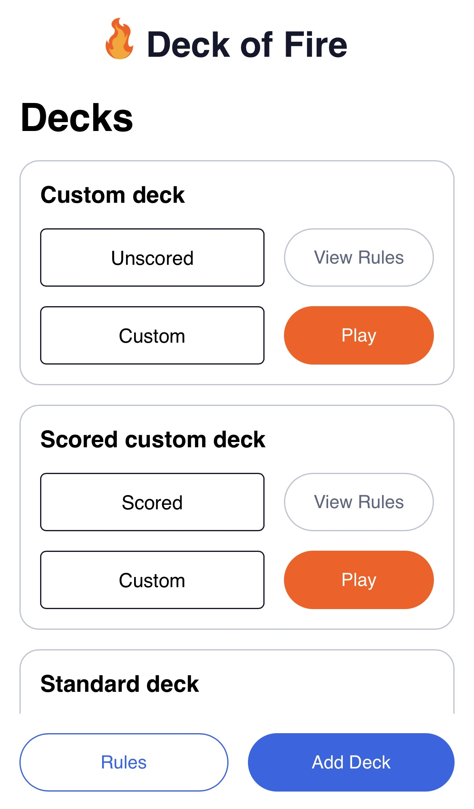
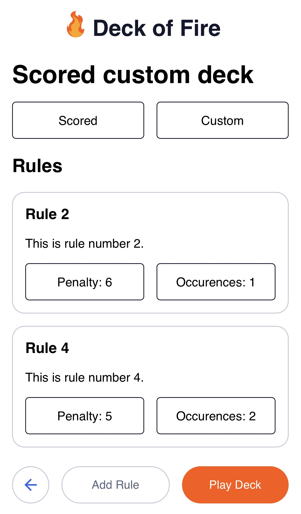
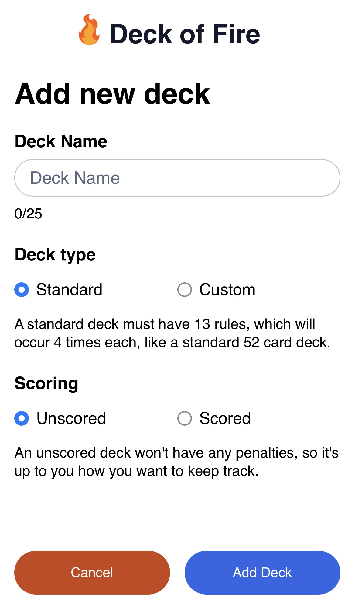
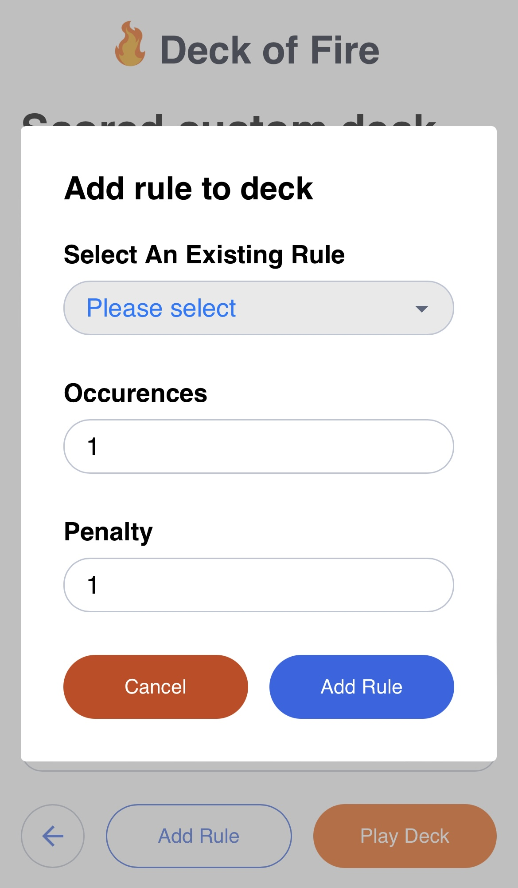
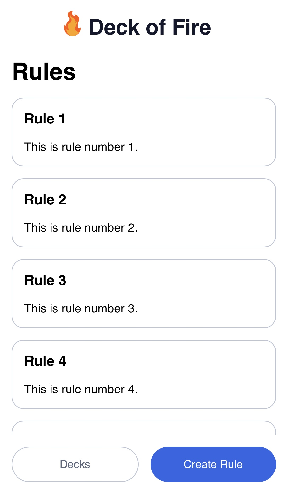
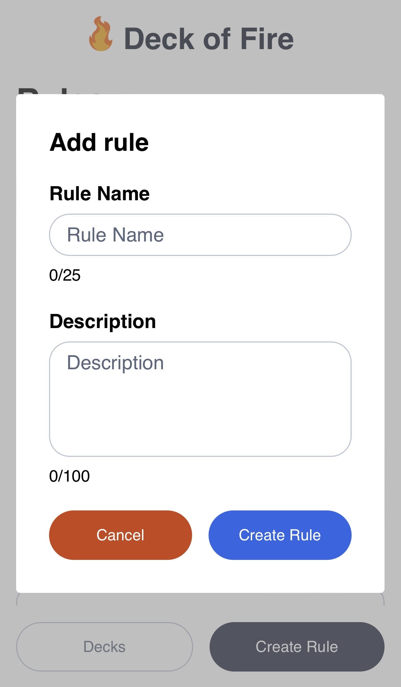
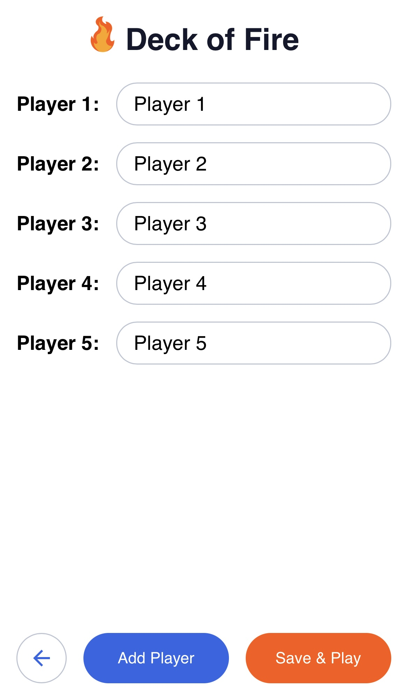
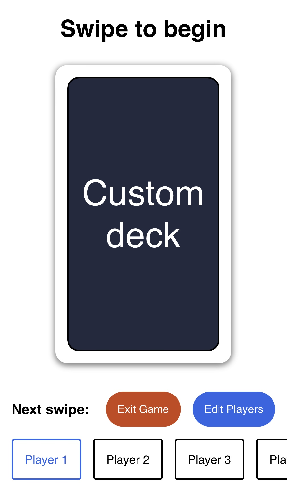
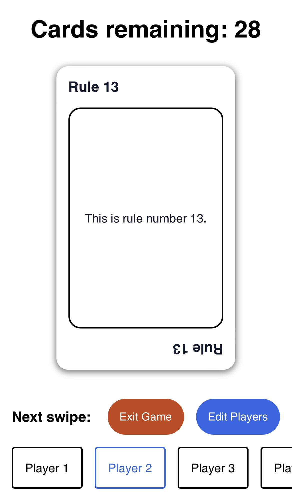

# Deck of Fire

A mobile web app based on the popular drinking game ring of fire with the aim of full customisation and an alternate scoring system that doesn't require drinking.

## Tech Stack & Dependencies

Teck Stack:

- React
- SASS
- Axios
- Vite

Dependencies:

- [react-router-dom](https://www.npmjs.com/package/react-router-dom)
- [card-deck](https://www.npmjs.com/package/card-deck)
- [react-tinder-card](https://www.npmjs.com/package/react-tinder-card)

## Running Locally

### Cloning the project

With SSH

```bash
  git clone git@github.com:kabirseth4/deck-of-fire-client.git
```

Or with HTTPS

```bash
  git clone https://github.com/kabirseth4/deck-of-fire-client.git
```

### Installing dependencies

Go to the project directory

```bash
  cd deck-of-fire-client
```

Install

```bash
  npm install
```

### Running

Start locally and on your local network

```bash
  npm start
```

Start locally only

```bash
  npm run dev
```

## Environment Variables

To run this project, you will need to add the following environment variable to your .env file:

`VITE_APP_BASE_API_URL`

If you are running the project locally this can be set to:

`http://localhost:<server-port-number>`

e.g. `http://localhost:8080`

If you are using the project on another device on the same network, this should be set to:

`http://<device-ip-address>:<server-port-number>`

e.g. `http://192.168.X.XXX:8080`

You can see your device IP address in the terminal when running `npm start`.

## Features & Usage

### Creating a deck

1. On the [Decks page](#decks-page), tap **Create deck** to go to the [Create deck page](#create-deck-page).

   - Here you can enter a name for your new deck and choose whether or not it is custom and scored.

### Creating a card

1. On the [Cards page](#cards-page), tap **Create Card** to bring up the [Create card modal](#create-card-modal).

   - Here you can add a name and description for your new card.

### Adding a card to a deck

1. On the [Decks page](#decks-page), tap **View Cards** on one of your existing decks to go to the [Deck details page](#deck-details-page).

2. Tap **Add Card** to bring up the [Add card to deck modal](#add-card-to-deck-modal).

   - Here you can select one of your previously created cards.
   - If you are adding to a _Custom_ and/or _Scored_ deck you will also be required to input a number of occurrences and/or a penalty respectively.

If your deck is _Standard_ and already has 13 cards, you will not be able to add any more cards.

### Playing a deck

Once a _Custom_ deck has at least one card, or exactly 13 cards for a _Standard_ deck, you will have the option to play the deck.

1. Tap either **Play Deck** on the [Deck details page](#deck-details-page) or **Play** on the [Decks page](#decks-page).

   - If this is the first time playing a deck you will be directed to the [Game setup page](#game-setup-page) where you can add your players.

2. Once you have added all your players, tap **Save & Play** to begin the game.

Enjoy!

## Screenshots

### Decks page



### Deck details page



### Create deck page



### Add card to deck modal



### Cards page



### Create card modal



### Game setup page



### Game page




## Next Steps

1. Implement authentication.
2. Implement game scoring system.
3. Add in ability to delete and update decks and cards
4. Add in default deck and guest flow for users who aren't logged in.
5. Cache game in local storage so that it doesn't restart on refresh.
6. Start developing support for cards with more complex logic.
